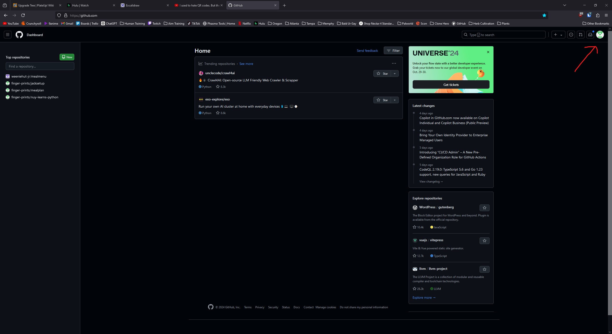
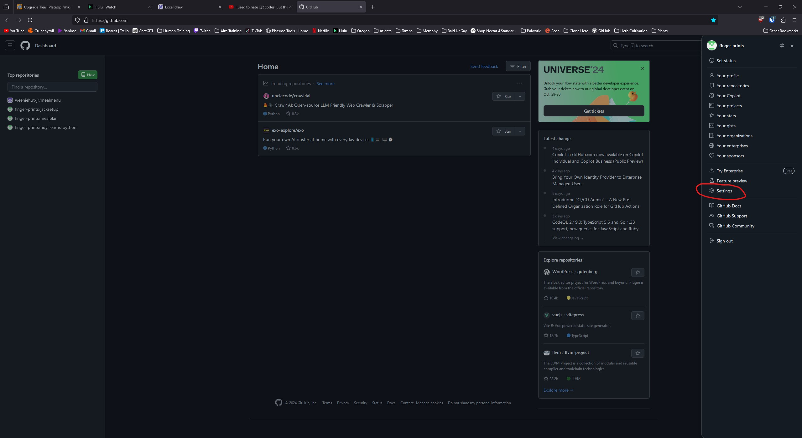
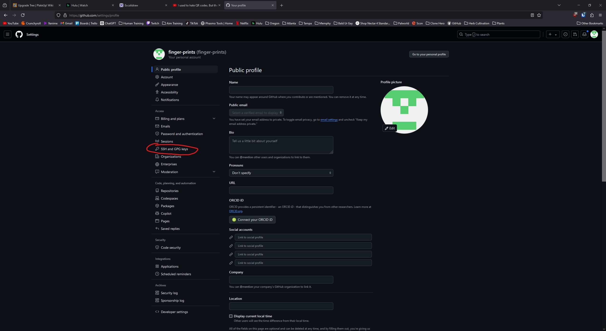
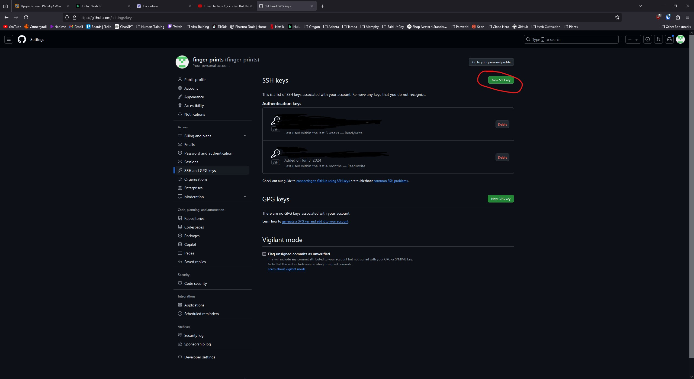
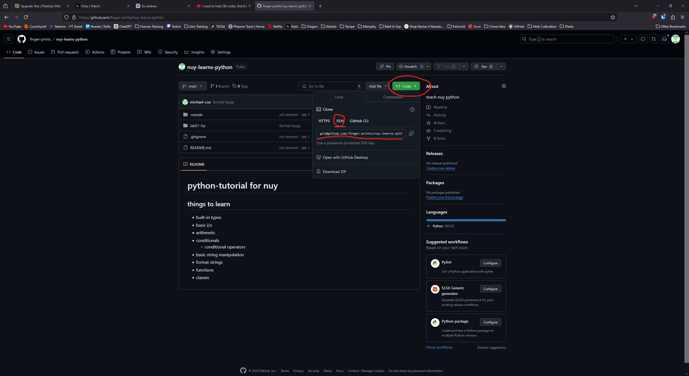

# Python Git Lab

In this lab, I'm going to force you to learn git and make you play with some
lists.

## Phase 1 - Cloning the repo
I don't know how much you remember - but version control in repositiories is the
way to keep track of code in a team. In this lab, we're going to pretend that
I'm the project lead hosting the repository, and you are an engineer who's going
to add features.

### Generating an SSH Key
In order for `github.com` to know who you are, you have to authenticate somehow
- you could do username and password authentication, but I don't love the way
github handles that. So I want you to use SSH keys. With SSH keys, you generate
a private key and a public key. Then you can share the public key with anyone on
the internet, and they can verify if they are talking to you by asking you a
challenge that only someone with the private key could answer. So let's get to it.

1. First, you need to generate a keypair. In a handy dandy terminal, run the
`ssh-keygen` command:
```
ssh-keygen -t ed25519 -f ~/.ssh/github
```
In this command, `-t` is specifying the type of encryption (rsa and ed25519 are
the most well-used I believe). `-f` is telling the output location. So when I
run the command, it creates two files: `~/.ssh/github` (private key) and
`~/.ssh/github.pub` (public key).

2. Now we have to tell github about this key. Go to https://github.com
3. Click on the profile icon in the top right and go to **Settings**


4. Now click on **SSH and GPG keys** on the left

5. Now click **New SSH key** in the top right

6. In the **Title** field, we're just giving a name to the key for our own
reference, so choose whatever name you want - maybe named after the computer
you'll be ssh'ing from.
7. Now copy the contents of the public key file you generated (should be the
file `github.pub`) to the **Key** box

### Managing an SSH Agent
Now that you have a key that you can use to verify your identity and told github
about it, you need to tell ssh that you are going to use that key. You do that
by running an `ssh-agent` and adding your key to it. Since your key is encryted
with a secret, you'll have to redo this every time you restart your computer or
your shell loses configuration.
1. In a terminal, start your agent
```
ssh-agent > ~/.ssh/agent.sh
```
`ssh-agent` creates an agent process on your computer and prints some
environment variables that your shell can store to keep track of your agent. In
this case, the `>` operator redirects the output to a file at `~/.ssh/agent.sh`.
2. Have your shell run/save environment variables from that file by running
```
source ~/.ssh/agent.sh
```
`source` is a command built into your shell that executes a script in your shell (aka updates your environment variables).
3. Add the private key you created
```
ssh-add ~/.ssh/github
```

Now, you can see what keys you have added with `ssh-add -l`. If you're ever not
sure if you have a key added, you can check there. It'll also tell you if you
don't have an agent running if it looks like this:
```
> ssh-add -l
Error connecting to agent: Connection refused
```
If your shell lost your agent environment variables but the agent is still
running, you can restore the running agent by re-`source`-ing the file.
```
# ps: list running processes -eaf are some arguments to force listing all
# programs => grep: search the results for "ssh-agent"
> ps -eaf | grep ssh-agent      
miccox3   2367    14  0 12:04 ?        00:00:00 ssh-agent -t 10h

# does our agent file still exist?
> ls -l ~/.ssh/agent.sh
-rw-r--r-- 1 miccox3 miccox3 133 Oct  1 12:07 /home/miccox3/.ssh/agent.sh

# re-source
> source ~/.ssh/agent.sh
Agent pid 2698

# is our key still added?
> ssh-add -l
The agent has no identities.
```
To stop an agent (ex. you finished working and want to clean up running
processes), use `ssh-agent -k`. This will use the same environment variables to
kill the running agent process and then clean the environment.

### Cloning the repo
Now that we've told github about the key and added it to an agent, we can use
the program git to clone this repo.

1. On this repo in github, click on the **Code** button in the top right.
2. A popup window should appear that says **Clone** and has a couple tabs. Click
on the SSH tab and copy the URL that appears.

3. Now we just have to tell git what to do - in your terminal again, run the following command.
```
git clone <repo_url>
```
That should clone the repository from github onto your computer.

### Phase 1 Command Reference

| Command  | Description  | Example  | Example Explanation  |
|----------|--------------|----------|----------------------|
| `ssh-keygen`  | Generates ssh keypairs (public & private)  | `ssh-keygen -t ed25519 -f my_key`  | Generate an ed25519 key pair to `my_key` and `my_key.pub` in your current directory  |
| `ssh-agent`  | Creates, kills, and manages ssh agents  | `ssh-agent -t 10h > ~/.ssh/agent.sh`  | Create an ssh agent that removes keys after 10 hours and redirect it from the terminal to a file at `~(your home)/.ssh/agent.sh`  |
| `ssh-add`  | Add (and remove/manage) ssh keys from your agent  | `ssh-add ~/.ssh/my_private_key`  | Add the private key in the file `~/.ssh/my_private_key` to your agent  |
| `ps`  | List running processes  | `ps -eaf | grep search_string`  | List details about all running processes and search that list for `search_string`  |
| `source`  | Run a shell script in your shell to update shell settings/environment variables  | `source ~/.zshrc`  | Re-load your `zshrc` - the script that configures `zsh` everytime you start a shell  |

#### ssh-keygen
| Option  | Description  | Example  |
|---------|--------------|----------|
| `-t <type>`  | Generate a key with a specified type  | `ssh-keygen -t ed25519`  |
| `-f <filename>`  | Output keys to `filename` and `filename.pub`  | `ssh-keygen -t ed25519 -f ~/.ssh/my_key`  |
| `-b <number_bits>`  | Set a number of bits for the encryption algorithm  | `ssh-keygen -t rsa -b 4096`  |

#### ssh-agent
| Option  | Description  | Example  |
|---------|--------------|----------|
| `-t  <time>{smhdw}`  | Create an agent that expires added keys after they've been added for `time` seconds/minutes/hours/days/weeks  | `ssh-agent -t 10h`  |
| `-k`  | Kill the running agent  | `ssh-agent -k`  |

#### ps
`ps` is a weird command with a weird history - I forget the details but
basically it has 2 entirely different ways of using it. There's a set of
arguments for using the program with BSD syntax (without the `-`), and there's a
set of arguments with the `-` like most other GNU/linux programs. That's not
crazy, but the other crazy part is that the same letter can mean different
things depending on if it has a `-` or not.  give another set of arguments if
you have the preceding `-`.

| Option  | Description  | Example  |
|---------|--------------|----------|
| `-e`  | Select all processes  | `ps -e`  |
| `-a`  | Select all processes except session leaders (processes associated with the terminal)  | `ps -eaf'  |
| `-f`  | Full format listing  | `ps -eaf`  |

Generally with `ps`, 99% of the time I'm going to just throw the entire `-eaf`
to get a full listing.

## Phase 2 - Tic Tac Toe
This time, I've made a really quick version of tic tac toe. I decided to
represent the whole game as `class TicTacToe`. As you somewhat know, classes are
a way to group data and group some functions as specifically attached to that
class.

### The Data
When you define a class, you can then create an **instance** of a class by
assigning it to a variable.
```
class TicTacToe:
    # some definition of what it means to be a tic tac toe

# making a specific instance and storing it as my_tictactoe
my_tictactoe = TicTacToe()
```

**Instance variables** are variables unique to each instance of the class.
**Static variables** are variables that are the same across all instances of a
*class.

Both types are referenced by `my_tictactoe.variable`, but static variables can
also be referenced with `TicTacToe.variable` since the variable is the same for
the class as a whole. In my `TicTacToe` class, all of the data is stored in
**instance variables**. In Python, unlike a lot of other languages, instance
variables are defined in the initializer (also called constructors in other
languages) - a special function called `__init__()` that you define to tell
python how to setup a class.

So you can see the data in `tictactoe.py`:
```
class TicTacToe:
    def __init__(self):
        self.board = [" "] * 9
        self.game_state = GameState.NOT_FINISHED
```

There are two variables - `self.board` and `self.game_state` (`self` is a way to
refer to an instance from functions defined in the class - when a function takes
`self` as the first argument, it uses `self.variable` or `self.function()` to
access its instance variables and functions)
- `self.board` is a list with 9 characters that should be either "X", " ", or "O".
- `self.game_state` is an enum that represents what state the game is in (more on enums later)

### So what's the lab?
Since we're learning git/github, I've decided to tell you what to do through
**issues** - github's way to report bugs or request features in the repository.

I'll try to be descriptive about each thing I want you to do in this repo's [issues](./issues)